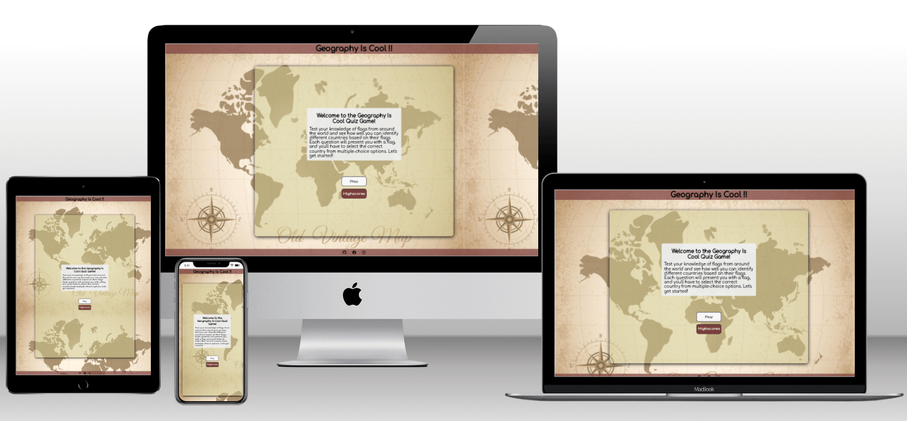
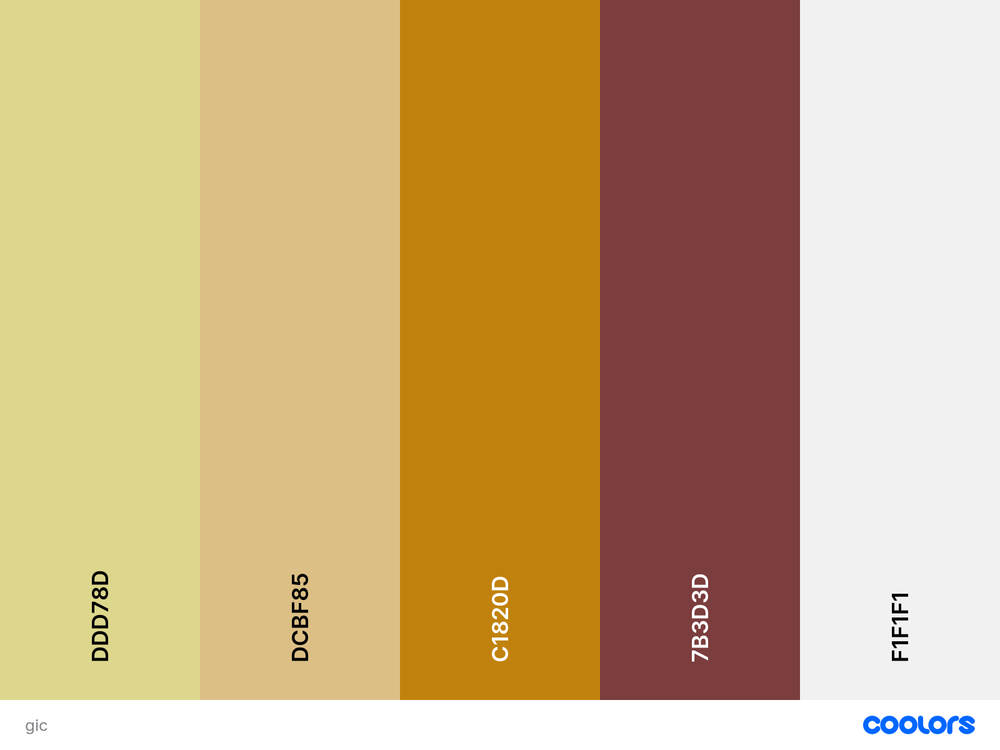
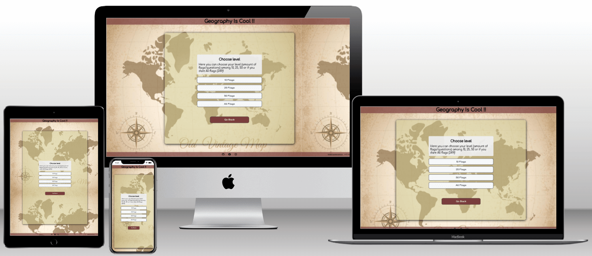
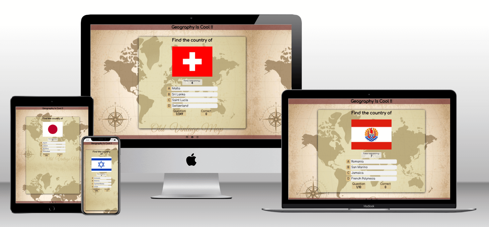
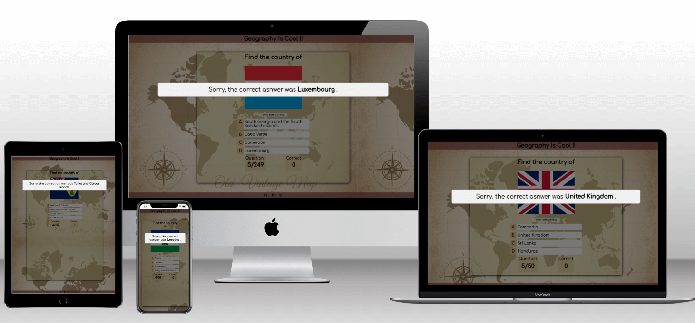
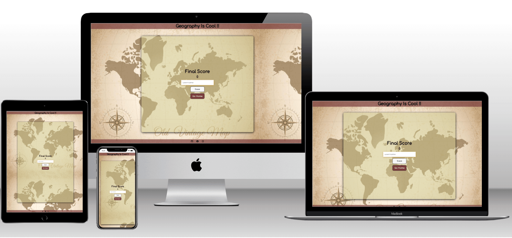
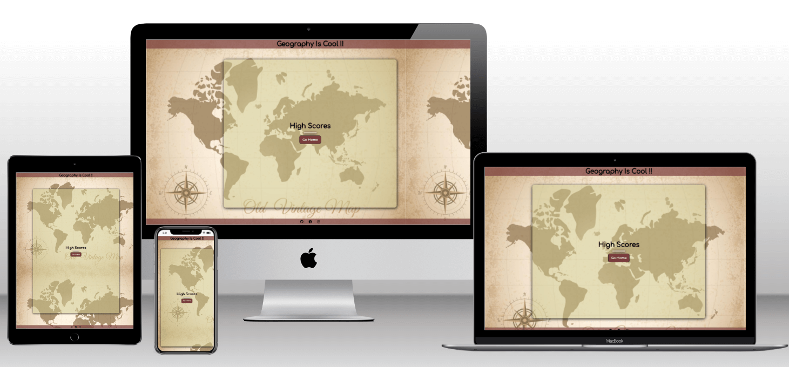
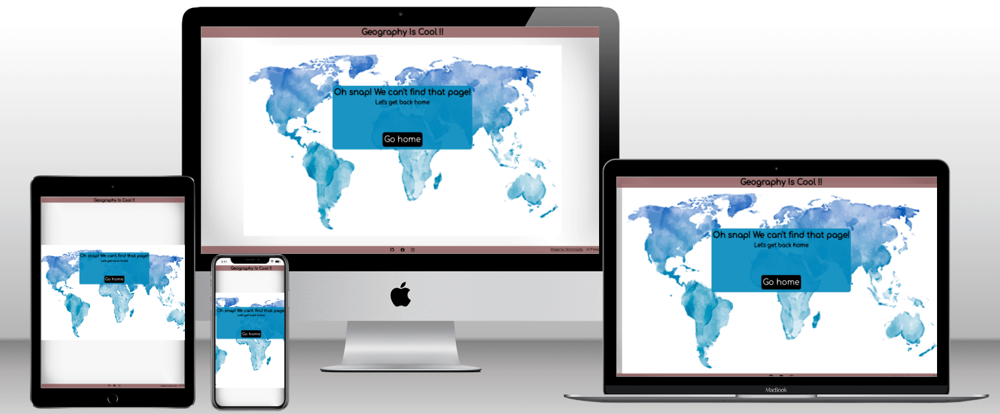

# Geography Is Cool!!

This project has been developed for the PP2 of Code Institute. It is
a flag quiz game and it aims to entertain and educate people with the flags of all the countries.

 

[View the deployed project here](https://vasileios20.github.io/geography-is-cool/index.html)

## Contents

* [Design](#design)
  * [Colour Scheme](#colour-scheme)
  * [Typography](#typography)
  * [Wireframes](#wireframes)
* [User Experience (UX)](#user-experience-ux)  
* [Features](#features)
  * [Home Page](#home-page)
  * [Choose Level Page](#choose-level-page)
  * [Game Page](#game-page)
    * [Modal](#modal)
  * [End Page](#end-page)
  * [Highscores Page](#highscores-page)
  * [404 error Page](#404-error-page)
* [Technologies Used](#technologies-used)
  * [Languages Used](#languages-used)
  * [Frameworks, Libraries & Programs Used](#frameworks-libraries--programs-used)
* [Deployment and Local Development](#deployment-and-local-development)
  * [Deployment](#deployment)
  * [Local Development](#local-development)
    * [How to fork](#how-to-fork)
    * [How to clone](#how-to-clone)
* [Testing](#testing)
* [Credits](#credits)

# Design

   ## Colour Scheme
   
   ## Typography
   The Comfortaa font was chosen because of its rounded edges that make it easy to read.
   
   The font imported from [Google fonts](https://fonts.google.com/specimen/Comfortaa?query=com)
   ## Wireframes
   [Start Page](documentation/wireframes/start-page.png)

   [Choose Page](documentation/wireframes/choose-level-page.png)

   [Game Page](documentation/wireframes/game-page.png)
   
   [End Page](documentation/wireframes/end-page.png)

# User Experience (UX)

  || Goal | |
  |--|--|--| 
  |Client|A simple and easy to understand how to play quiz| 
  ||A fun and educational quiz| 
  |First Time User|I want to know what is the quiz about|
  ||I want to know how to play the quiz|
  ||I want to choose level of difficulty|
  ||I want to know to know if my answer was correct or wrong|
  ||I want to know the correct answer if I answered wrong|
  ||I want to know how how many questions played/left|
  ||I want to know my final score|
  ||I want to save my score|
  ||I want to find out who the author is|
  ||I want to connect on their social media|
  |Returning User|I want to choose level of difficulty| 
  ||I want to choose different levels of dificculty such as speed $round^1$|
  ||I want to choose different level of questions such as flags per $continent^1$|
  |Frequent User | I want to find out if there is a new $service^1$|
  ||I want to choose different type of questions such as find the capital of the $country^1$|
  ||I want to choose different type of questions such as find the country on the $map[^1,^2]$|
  
  $^1$ To be implemented in the future

  $^2$ A map will be added, the user will have either to drag and drop the country on the map or click on the map to answer.

# Features

On all pages there is a header with the title of the quiz and a footer with GitHub and social links.

## Home Page

The home page displays a container with a welcome message and how to play text and 2 buttons, Play and Highscores.

When the Play button clicked displays the [choose level page](#choose-level-page).

When the Highscores button clicked displays the [highscores page](#highscores-page).

## Choose Level Page

The choose level page displays a container with a choose level message and 5 buttons. 4 buttons to choose number of flags (10, 25, 50, All) and the Go Back button that redirects to the [home page](#home-page).

## Game Page

The game page displays a container which holds a flag image as question, a timer of 10 seconds, 4 answer buttons, a question counter on the bottom left and a correct answer counter on the bottom right.

When the user chooses the level(number of questions) the game page will be displayed with a question and the timer will start counting down.

The user has to select one of the answers, if correct the background of the button will become green and the [modal](#modal) will be displayed with a congratulations message. If the answer is wrong the button's background colour will become red and the [modal](#modal) will be displayed with a message with the correct answer.

When last question has been answered the [end page](#end-page) will be displayed.

### Modal

## End Page

The end page displays a container with the final score, a text input for the user to enter their username, a Save button and a Go Home button. 

The save button is disabled until the user type in the input. Once typed becomes active and when clicked it saves the score and redirects to the [home page](#home-page). 

The Go Home button redirects to the [home page](#home-page).

## Highscores Page

The highscores page dislays a container with a table of the top 5 highscores and a Go Home button that redirects to the [home page](#home-page).

## 404 error page

The error page displays an error message and a button that redirects to the [home page](#home-page)

# Technologies Used

## Languages Used

HTML, CSS, JS

## Frameworks, Libraries & Programs Used

* [GitHub](https://github.com/) - To save and store files for the website.
* [GitPod](https://gitpod.io/) - IDE used to create the site.
* [Techsini](https://techsini.com/multi-mockup/index.php) - To show the web image in various devices.
* [Google Fonts](https://fonts.google.com/) - To import the fonts used on the website
* [Google Developer Tools](https://developer.chrome.com/docs/) - To test features, resposiveness and stylilng.
* [TinyPNG](https://tinypng.com/) - To reduce size of the images.
* [Favicon](https://favicon.io/) - To create favicon.
* [Shields IO](https://shields.io/) - To add badges to README.
* [Coolors](https://coolors.co/) - To create colours palette.
* [VSCode](https://code.visualstudio.com/) - Code editor used for local development.
* [GetFireShot](https://getfireshot.com/) - To capture screeshots for testing images.

# Deployment and Local Development

## Deployment
The site is deployed using GitHub Pages. Deployed site [Geography Is Cool!!](https://vasileios20.github.io/geography-is-cool/index.html)

To deploy the site to GitHub Pages :
1. Log in (sign up) to GitHub.
2. Go to the repositoty for this project [Geography Is Cool!!](https://github.com/Vasileios20/geography-is-cool).
3. Go to settings.
4. Select Pages from the left hand menu.
5. From the dropdown menu at source select the main branch and press save.
6. The site has been deployed. Check at the top of the page, it might take a couple of minutes.
## Local Development
### How to fork
To fork the repository :
1. Log in (sign up) to GitHub.
2. Go to the repository for this project [Geography Is Cool!!](https://github.com/Vasileios20/geography-is-cool).
3. Click the fork button in the top right corner.

### How to clone
To clone the repository :
1. Log in (sign up) to GitHub.
2. Go to the repository for this project [Geography Is Cool!!](https://github.com/Vasileios20/geography-is-cool).
3. Click on the code button, select one of the HTTPS, SSH or GitHub CLI and copy the link shown.
4. Open the terminal in your code editor and change the current working directory to the location you want to use for the cloned directory.
5. Type 'git clone' into the terminal and then paste the link you copied in step 3. Press enter.

# Testing

Please see [Testing](TESTING.md)

# Credits

## Title

The title's name borrowed from the Facebook page [Η γεωγραφία είναι πολύ κουλ](https://www.facebook.com/geografitness)

## Code Used
Countries array and flag .png images  borrowed from [hampusborgos](https://github.com/hampusborgos/country-flags) repository on GitHub. I edited the JSON file and converted it to .js file.

Flag .svg images borrowed from [lipis](https://github.com/lipis/flag-icons) repository on GitHub.

To build the project I followed the [Code Geek](https://www.youtube.com/watch?v=Opje9VBrNfg) tutorial on youtube.

I used [W3Schools](https://www.w3schools.com/) and [stackoverflow](https://stackoverflow.com/) for varius enquiries I had through the proccess of building the quiz.

To generate and display answers and question a combination of [stackoverflow](https://stackoverflow.com/questions/43893667/adding-answers-to-a-random-questions-quiz-javascript) and [shecodes](https://www.shecodes.io/athena/10246-how-to-show-random-questions-in-a-quiz-using-javascript) article.

## Media

Background [Image by macrovector on Freepik]("https://www.freepik.com/free-vector/old-colored-map_9386675.htm#page=2&query=world%20map&position=33&from_view=search&track=ais") 

## Aknowledgments
My mentor Brian Macharia for guidance, support and feedback during the project.

The tutors from [Code Institute](https://codeinstitute.net/) Martin, Holly and Sean for helping with the issues that I faced.

The Facebook page [Η γεωγραφία είναι πολύ κουλ](https://www.facebook.com/geografitness) for letting me use their title and inspiring me to build this project.

The people on slack community that took some time to test the quiz and give feedback.

My friends who were my beta testers!

And a massive thank you to my partner Vicky for the support and patience!